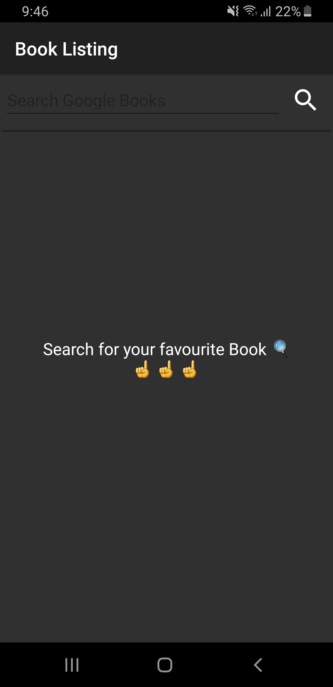

# Book Listing

This is an Android Application that uses Google's Books API to search for books (By title, category or author), list them for you and provides a brief information about each book. If you are interested in a specific book you can click on the 'BUY' button which will automatically take you to the Google Play Store if there was an eBook available for it, if not it will take you to (Google Books) site where you can read more about the book or get a copy from amazon or any other site that sells that book you are interested in.
  
  
* **Note :** This was my first ever completed android project, built for my Mobile App Development course in university 2 years ago.

## Screenshots
    

     
      
      
  
     
       
       
  
     
     
   
## Built With

* [Android Studio](https://developer.android.com/studio/?gclid=Cj0KCQiAtrnuBRDXARIsABiN-7BH-n_44qHpgiYIn0QeA20VMrD_rHJTwTyq1ZagoQOyrBsp9Wd4Aa0aAiliEALw_wcB) - Android Studio is the official integrated development environment (IDE) for Android application development.

## Built By

* **Omar AlQaisi** - [OmarQaisi](https://github.com/OmarQaisi)

## License

This project is licensed under the MIT License - see the [LICENSE.md](LICENSE.md) file for details
